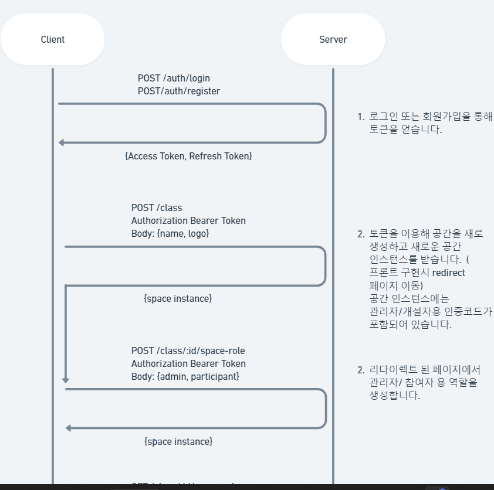
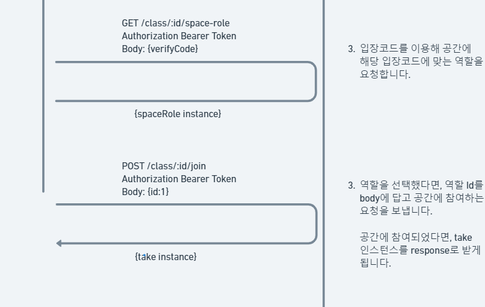

## Database<br>
1. 다음 명령어를 사용해서 mysql:5.7 컨테이너를 생성해 줍니다.<br>
```shell
docker run --name mysql-local -p 3306:3306/tcp -e MYSQL_ROOT_PASSWORD=test -d mysql:5.7
```

2. 다음 명령어를 사용해 interactive mode로 mysql 이미지를 올려놓은 도커에 접속해 줍니다.<br>
```shell
docker exec -it mysql-local bash
```

3. 다음 명령어를 사용해 vim 을 설치하고, 한국어를 지원하도록 환경파일을 수정하겠습니다.
```shell
yum install vim 

vim /etc/mysql/my.cnf

# /etc/mysql/my.cnf 에 복사할 내용
[client]
default-character-set=utf8

[mysql]
default-character-set=utf8

[mysqld]
collation-server = utf8_unicode_ci
init-connect='SET NAMES utf8'
character-set-server = utf8
```

4. development, production 용 데이터베이스를 각각 생성하겠습니다.

```shell
# development
CREATE DATABASE classum_dev DEFAULT CHARACTER SET utf8 COLLATE utf8_general_ci;

# production
CREATE DATABASE classum_prod DEFAULT CHARACTER SET utf8 COLLATE utf8_general_ci;
```

## Server

1. start server<br>
각각의 환경에서 실행시킨다면 미리 정의해둔 환경설정 값에 따라 데이터베이스에 연결합니다.<br>
각각의 환경설정 값은 /src/config/env/ 에서 확인할 수 있습니다.<br>
```shell
# development
yarn start:dev

# production
yarn start:prod
```

### API
API 테스트는 다음 공유해드린 링크를 통해 확인하실 수 있습니다.<br>

추가로 space를 생성하는 로직은 다음 그림으로 남겨두었습니다.<br>


[postman 웹 링크](https://documenter.getpostman.com/view/20135732/2s93CKNu1S)




